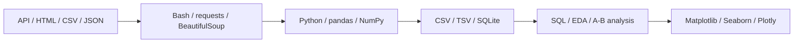

# Python Data Toolkit


Набор учебных проектов и практических заданий по обработке данных на
**Python**, **SQL** и **Unix-инструментах**.

Репозиторий охватывает сбор и преобразование данных, объектно-ориентированное
проектирование, тестирование, профилирование, оптимизацию потребления памяти,
аналитический SQL и визуализацию.

> Репозиторий содержит учебные работы. Основная цель — продемонстрировать
> практическое применение инструментов обработки и анализа данных.

## Ключевые направления

- получение и преобразование данных из внешних API;
- обработка JSON, CSV и TSV;
- автоматизация обработки данных с помощью Bash, `curl`, `jq` и `awk`;
- разработка Python-скриптов и ООП-компонентов;
- сбор данных с веб-страниц;
- unit-тестирование с использованием `pytest`;
- мокирование внешних HTTP-запросов;
- профилирование времени выполнения и потребления памяти;
- обработка данных с помощью pandas и NumPy;
- аналитические SQL-запросы;
- исследовательский анализ данных;
- визуализация результатов.

## Схема работы с данными



## Технологический стек

| Направление | Инструменты |
|---|---|
| Язык программирования | Python |
| Командная строка | Bash, AWK, curl, jq |
| Сбор данных | requests, BeautifulSoup |
| Обработка данных | pandas, NumPy |
| Базы данных | SQLite, SQL |
| Тестирование | pytest, unittest.mock |
| Профилирование | cProfile, pstats, timeit, psutil |
| Визуализация | Matplotlib, Seaborn, Plotly |
| Рабочая среда | Jupyter Notebook, virtualenv |

## Структура репозитория

```text
python-data-toolkit/
├── 01_unix_tools/          # получение и обработка данных в Unix
├── 02_python_core/         # Python Core и структуры данных
├── 03_oop_architecture/    # ООП, конфигурация и логирование
├── 04_env_and_testing/     # окружение, web scraping и pytest
├── 05_optimization/        # генераторы, timeit и оптимизация памяти
├── 06_movielens_eda/       # исследовательский анализ MovieLens
├── 07_pandas_advanced/     # очистка и оптимизация DataFrame
├── 08_sql_and_ab_testing/  # SQLite, SQL и анализ эксперимента
├── 09_data_visualization/  # визуализация и data storytelling
└── README.md
```

## Модули

### 1. Unix Tools and Data Processing

Каталог: [`01_unix_tools`](./01_unix_tools)

Пайплайн командной обработки данных, получаемых через API.

Основные задачи:

- получение JSON через `curl`;
- фильтрация данных с помощью `jq`;
- преобразование JSON в CSV;
- очистка и сортировка записей;
- разбиение результирующего набора данных на файлы;
- объединение обработанных частей.

Используемые инструменты:

```text
Bash, curl, jq, awk, CSV, JSON
```

### 2. Python Core

Каталог: [`02_python_core`](./02_python_core)

Практические задания по базовым возможностям Python:

- структуры данных;
- функции;
- работа с файлами;
- преобразование форматов;
- словари и множества;
- обработка аргументов командной строки;
- базовые алгоритмы.

### 3. OOP and Application Structure

Каталог: [`03_oop_architecture`](./03_oop_architecture)

Переход от отдельных скриптов к структурированным Python-приложениям.

Рассматриваемые темы:

- классы и композиция;
- разделение ответственности;
- конфигурационные файлы;
- обработка исключений;
- логирование;
- интеграция с Telegram API для отправки уведомлений.

### 4. Environment, Web Scraping and Testing

Каталог: [`04_env_and_testing`](./04_env_and_testing)

Практика воспроизводимой разработки и тестирования:

- создание виртуального окружения;
- фиксация зависимостей;
- получение данных с веб-страниц;
- обработка HTTP-ошибок;
- профилирование через `cProfile`;
- unit-тестирование через `pytest`;
- мокирование внешних HTTP-запросов.

### 5. Python Performance and Memory Optimization

Каталог: [`05_optimization`](./05_optimization)

Сравнение различных способов обработки данных в Python:

- обычная загрузка данных в память;
- потоковая обработка через генераторы;
- использование `map`, `filter` и `reduce`;
- применение `collections.Counter`;
- измерение времени выполнения через `timeit`;
- сравнение потребления ресурсов.

### 6. MovieLens Exploratory Data Analysis

Каталог: [`06_movielens_eda`](./06_movielens_eda)

Исследовательский анализ данных MovieLens:

- загрузка и подготовка данных;
- объединение связанных наборов;
- анализ рейтингов, фильмов и пользователей;
- расчёт описательных статистик;
- исследование жанров и пользовательского поведения;
- представление результатов в Jupyter Notebook.

### 7. Advanced pandas

Каталог: [`07_pandas_advanced`](./07_pandas_advanced)

Очистка и преобразование табличных данных:

- обработка пропущенных значений;
- изменение типов данных;
- использование категориальных признаков;
- группировки и сводные таблицы;
- векторизация вычислений;
- уменьшение потребления памяти DataFrame.

> Численные результаты оптимизации приведены в соответствующем notebook
> и зависят от версии библиотек и среды выполнения.

### 8. SQL and Experiment Analysis

Каталог: [`08_sql_and_ab_testing`](./08_sql_and_ab_testing)

Набор заданий по работе с SQLite и аналитическим SQL:

- фильтрация данных;
- подзапросы;
- `JOIN`;
- группировки и агрегаты;
- подготовка аналитических выборок;
- сравнение контрольной и экспериментальной групп.

> Модуль демонстрирует учебный анализ эксперимента и не является
> полноценной платформой проведения A/B-тестов.

### 9. Data Visualization

Каталог: [`09_data_visualization`](./09_data_visualization)

Практика визуального анализа данных:

- линейные и столбчатые графики;
- boxplot;
- scatter matrix;
- heatmap;
- временные ряды;
- интерактивные визуализации Plotly.

## Запуск

### 1. Клонирование репозитория

```bash
git clone https://github.com/BulatKSMNT/python-data-toolkit.git
cd python-data-toolkit
```

### 2. Создание виртуального окружения

Linux/macOS:

```bash
python3 -m venv .venv
source .venv/bin/activate
```

Windows PowerShell:

```powershell
python -m venv .venv
.venv\Scripts\Activate.ps1
```

### 3. Установка зависимостей

После добавления общего файла `requirements.txt`:

```bash
python -m pip install --upgrade pip
pip install -r requirements.txt
```

### 4. Запуск Jupyter

```bash
jupyter notebook
```

После запуска выберите интересующий модуль и откройте соответствующий
файл `.ipynb`.

Отдельные Python-скрипты запускаются из корня соответствующего модуля:

```bash
cd 05_optimization
python benchmark.py
```

Unix-скрипты рекомендуется запускать в Linux, macOS или WSL.

## Воспроизводимость

Часть заданий получает данные из внешних API и веб-страниц. Результат
может зависеть от:

- доступности внешнего источника;
- изменения структуры HTTP-ответа;
- версии используемых библиотек;
- наличия исходного датасета;
- операционной системы.

Перед запуском отдельного модуля необходимо проверить его входные данные
и локальные инструкции.

## Известные ограничения

- модули являются отдельными учебными заданиями, а не единым приложением;
- общего автоматического пайплайна запуска пока нет;
- некоторые задания требуют внешних наборов данных;
- Unix-скрипты могут потребовать Linux, macOS или WSL;
- автоматическая проверка всех notebook пока не настроена;
- CI/CD и контейнеризация пока отсутствуют.


## Связанный репозиторий

Продолжение работы с данными и алгоритмами машинного обучения:

[`All-DS-ML-projects`](https://github.com/BulatKSMNT/All-DS-ML-projects)

## Автор

**Булат Хатыпов**

- GitHub: [BulatKSMNT](https://github.com/BulatKSMNT)
- Telegram: [@khat911](https://t.me/khat911)
